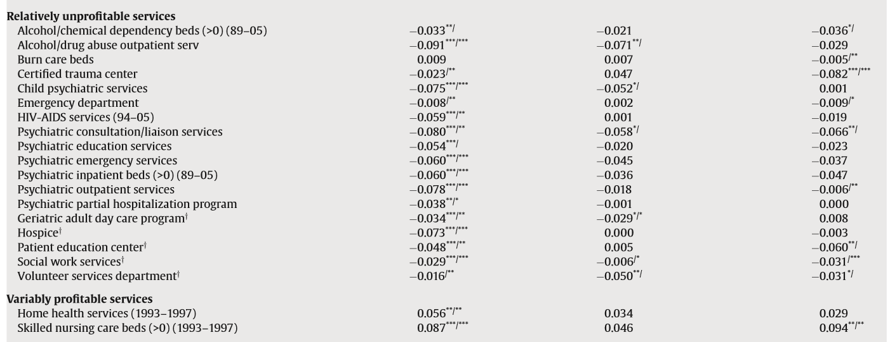
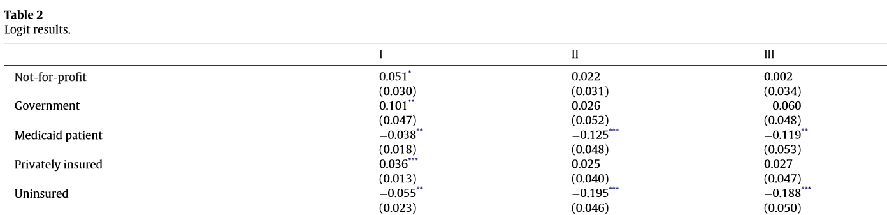

<!-- Adjust some CSS code for font size and maintain R code font size -->
<style type="text/css">
.remark-slide-content {
    font-size: 30px;
    padding: 1em 2em 1em 2em;    
}
.remark-code, .remark-inline-code { 
    font-size: 20px;
}
</style>


<!-- Set R options for how code chunks are displayed and load packages -->
```{r setup, include=FALSE}
options(htmltools.dir.version = FALSE)
library(knitr)
opts_chunk$set(
  fig.align="center",  
  fig.height=3, #fig.width=6,
  # out.width="748px", #out.length="520.75px",
  dpi=300, #fig.path='Figs/',
  cache=T#, echo=F, warning=F, message=F
  )

knitr::opts_hooks$set(fig.callout = function(options) {
  if(options$fig.callout) {
    options$echo = FALSE
  }
  options
})

```


# Table of contents

1. [Motivation](#motivation)

2. [Research Design](#design)

3. [Horwitz and Nichols (2009)](#hn)

4. [Bayindir (2012)](#bayindir)

5. [Takeaways](#final)


<!-- New Section -->
---
class: inverse, center, middle
name: motivation

# Motivation

<html><div style='float:left'></div><hr color='#EB811B' size=1px width=1055px></html>


---
# Two motivating points

1. Hospital responses to changes in policy or strategic responses to each other depend on their objective functions

2. If not-for-profit hospitals are really "for profits in disguise", then we need to treat them as such


<!-- New Section -->
---
class: inverse, center, middle
name: design

# Research Design

<html><div style='float:left'></div><hr color='#EB811B' size=1px width=1055px></html>

---
# Research design

- Rely on "selection on observables" argument

- Horwitz and Nichols (2009): No omitted variables correlated with for profit market share and delivery of high vs low profitable services (or operating margins)

- Bayindir (2012): No omitted variables correlated with ownership type and procedure choice

--

- These are **very strong** assumptions...rare to see published in top field journals anymore


<!-- New Section -->
---
class: inverse, center, middle
name: hn

# Horwitz and Nichols (2009)

<html><div style='float:left'></div><hr color='#EB811B' size=1px width=1055px></html>

---
# Main data:

- Hospital-level data from 1988 through 2005
- American Hospital Association Annual Surveys
- Healthcare cost Report Information System (for data on operating margins)


---
count: false

# Estimation

$$\begin{align}
Pr(\text{Service})_{it} = &\Phi(\beta_{0} + \beta_{1} F_{it} \\
                   & + \beta_{2} Y_{t} + \beta_{3} Y_{t} \times F_{it} \\
                   & + \beta_{4} \text{FPMarket}_{it} + \beta_{5} F_{it} \times \text{FPMarket}_{it} \\
                   & + \beta_{6} Y_{t} \times F_{it} \times \text{FPMarket}_{it} + \beta_{7} H_{it}  \\
                   & + \beta_{8} D_{it} + \beta_{9} HMO_{it} + \beta_{10} HHI_{it})
\end{align}$$


---
count: false

# Estimation

$$\begin{align}
\color{red}{Pr(\text{Service})_{it}} = &\Phi(\beta_{0} + \beta_{1} F_{it} \\
                   & + \beta_{2} Y_{t} + \beta_{3} Y_{t} \times F_{it} \\
                   & + \beta_{4} \text{FPMarket}_{it} + \beta_{5} F_{it} \times \text{FPMarket}_{it} \\
                   & + \beta_{6} Y_{t} \times F_{it} \times \text{FPMarket}_{it} + \beta_{7} H_{it}  \\
                   & + \beta_{8} D_{it} + \beta_{9} HMO_{it} + \beta_{10} HHI_{it})
\end{align}$$

- High versus low profitable service offering
- Determined in Horwitz (2005), based on interviews, MedPAC and ProPAC reports, and literature


---
count: false

# Estimation

$$\begin{align}
Pr(\text{Service})_{it} = &\Phi(\beta_{0} + \beta_{1} \color{red}{F_{it}} \\
                   & + \beta_{2} Y_{t} + \beta_{3} Y_{t} \times F_{it} \\
                   & + \beta_{4} \text{FPMarket}_{it} + \beta_{5} F_{it} \times \text{FPMarket}_{it} \\
                   & + \beta_{6} Y_{t} \times F_{it} \times \text{FPMarket}_{it} + \beta_{7} H_{it}  \\
                   & + \beta_{8} D_{it} + \beta_{9} HMO_{it} + \beta_{10} HHI_{it})
\end{align}$$

- Ownership type (for-profit, not-for-profit, government)


---
count: false

# Estimation

$$\begin{align}
Pr(\text{Service})_{it} = &\Phi(\beta_{0} + \beta_{1} F_{it} \\
                   & + \beta_{2} Y_{t} + \beta_{3} Y_{t} \times F_{it} \\
                   & + \beta_{4} \color{red}{\text{FPMarket}_{it}} + \beta_{5} F_{it} \times \color{red}{\text{FPMarket}_{it}} \\
                   & + \beta_{6} Y_{t} \times F_{it} \times \color{red}{\text{FPMarket}_{it}} + \beta_{7} H_{it}  \\
                   & + \beta_{8} D_{it} + \beta_{9} HMO_{it} + \beta_{10} HHI_{it})
\end{align}$$

- Indicator for high share of patients going to for-profit hospitals ($geq$ 15%)
- Construct share of for-profit patients using "distance-weighted" measure of hospital markets:

--

$$w_{ij} = \frac{N_{j}}{\left(1+a \times d_{ij}^{2} \right)^{2}}$$


---
count: false

# Estimation

$$\begin{align}
Pr(\text{Service})_{it} = &\Phi(\beta_{0} + \beta_{1} F_{it} \\
                   & + \beta_{2} Y_{t} + \beta_{3} Y_{t} \times F_{it} \\
                   & + \beta_{4} \text{FPMarket}_{it} + \beta_{5} F_{it} \times \text{FPMarket}_{it} \\
                   & + \beta_{6} Y_{t} \times F_{it} \times \text{FPMarket}_{it} + \beta_{7} H_{it}  \\
                   & + \beta_{8} D_{it} + \beta_{9} HMO_{it} + \beta_{10} \color{red}{HHI_{it}})
\end{align}$$

- Herfindahl-Hirschman Index (sum of square market shares)


---
# Results

.center[
  
]

- Percentage point change in probability of offering service in high for-profit markets
- Authors' takeaway is that NFP hospitals respond to FP market share but are not FP because they offer a different service mix


---
# Concerns

- For profit market share is endogenous. There are likely relevant omitted variables and reverse causality (FP hospitals strategically locate)
- What are the independent sources of variation in HHI, FPMarket, and HMO?
- Hard to say from main results that NFP act meaningfully differently than FP (of course they aren't identical)
- No meaningful effects on operating margin...how can this be?


<!-- New Section -->
---
class: inverse, center, middle
name: hn

# Bayindir (2012)

<html><div style='float:left'></div><hr color='#EB811B' size=1px width=1055px></html>


---
# Main data:

- Patient level data from 1999 to 2005
- National Inpatient Sample (for DRG codes and procedures) 
- American Hospital Association Annual Surveys (for hospital characteristics)


---
count: false

# Estimation

$$\begin{align}
Pr(\text{Proc})_{ijt} = &\text{L}(\beta_{0} + \beta_{1} O_{it} \\
                   & + \beta_{2} Y_{t} + \beta_{3} H_{it} \\
                   & + \beta_{4} P_{jt} + \beta_{5} p_{jt}\times DRG_{jt} \\
                   & + \beta_{6} \text{State}_{i})
\end{align}$$


---
count: false

# Estimation

$$\begin{align}
\color{red}{Pr(\text{Proc})_{ijt}} = &\text{L}(\beta_{0} + \beta_{1} O_{it} \\
                   & + \beta_{2} Y_{t} + \beta_{3} H_{it} \\
                   & + \beta_{4} P_{jt} + \beta_{5} p_{jt}\times DRG_{jt} \\
                   & + \beta_{6} \text{State}_{i})
\end{align}$$

- Is a given procedure done?
- Candidate procedures determined by identifying 3 most common DRGs for each procedure


---
count: false

# Estimation

$$\begin{align}
Pr(\text{Proc})_{ijt} = &\text{L}(\beta_{0} + \beta_{1} \color{red}{O_{it}} \\
                   & + \beta_{2} Y_{t} + \beta_{3} H_{it} \\
                   & + \beta_{4} P_{jt} + \beta_{5} p_{jt}\times DRG_{jt} \\
                   & + \beta_{6} \text{State}_{i})
\end{align}$$

- Indicators for ownership type


---
count: false

# Estimation

$$\begin{align}
Pr(\text{Proc})_{ijt} = &\text{L}(\beta_{0} + \beta_{1} O_{it} \\
                   & + \beta_{2} Y_{t} + \beta_{3} \color{red}{H_{it}} \\
                   & + \beta_{4} P_{jt} + \beta_{5} p_{jt}\times DRG_{jt} \\
                   & + \beta_{6} \text{State}_{i})
\end{align}$$

- Hospital characteristics from the AHA

---
count: false

# Estimation

$$\begin{align}
Pr(\text{Proc})_{ijt} = &\text{L}(\beta_{0} + \beta_{1} O_{it} \\
                   & + \beta_{2} Y_{t} + \beta_{3} H_{it} \\
                   & + \beta_{4} \color{red}{P_{jt}} + \beta_{5} p_{jt}\times DRG_{jt} \\
                   & + \beta_{6} \text{State}_{i})
\end{align}$$

- Patient characteristics from the NIS (age, race, sex, Charlson comorbidity index)


---
count: false

# Estimation

$$\begin{align}
Pr(\text{Proc})_{ijt} = &\text{L}(\beta_{0} + \beta_{1} O_{it} \\
                   & + \beta_{2} Y_{t} + \beta_{3} H_{it} \\
                   & + \beta_{4} P_{jt} + \beta_{5} \color{red}{p_{jt}\times DRG_{jt}} \\
                   & + \beta_{6} \text{State}_{i})
\end{align}$$

- Procedure group and DRG indicators


---
# Results

.center[
  
]

- FP less likely to offer a given procedure than other hospital types

---
# Concerns

- What does it mean to be less likely to offer a procedure?
- Circular analysis...using observed DRGs to determine candidate procedures and then investigating who is more likely to get a given procedure


<!-- New Section -->
---
class: inverse, center, middle
name: final

# Some Final Takeaways

<html><div style='float:left'></div><hr color='#EB811B' size=1px width=1055px></html>


---
# About the research

- Hard to sell selection on observables as an identification strategy
- Substantively, do FP and NFP have to behave identically to claim that NFPs are "for profits in disguise"? Seems too strict.

---
# About the presentation

- Use the presentation to show the work in a different way 
- More freedom than in a paper (doesn't have to be so linear)
- Speak more, write less