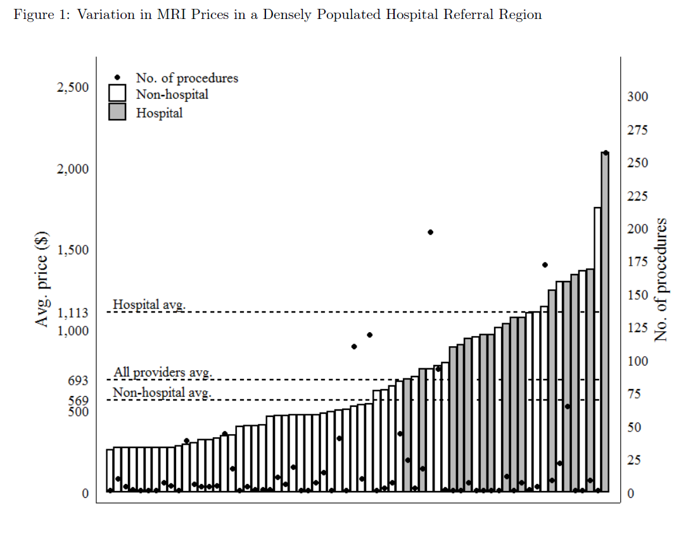
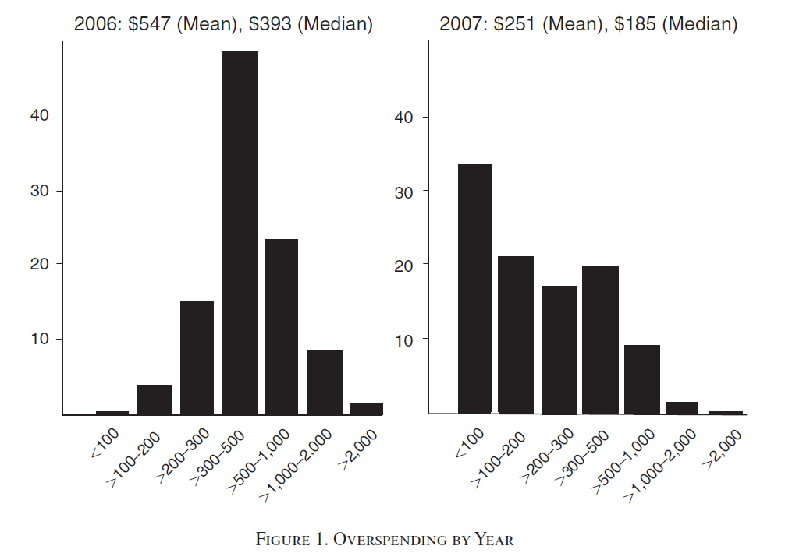
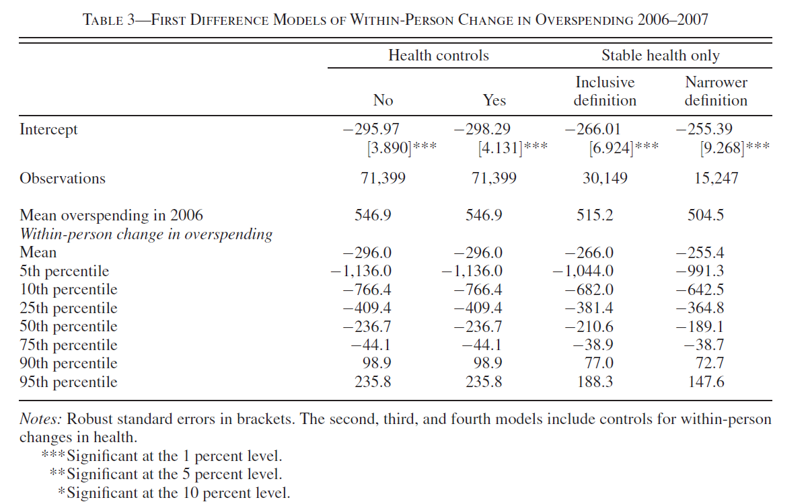
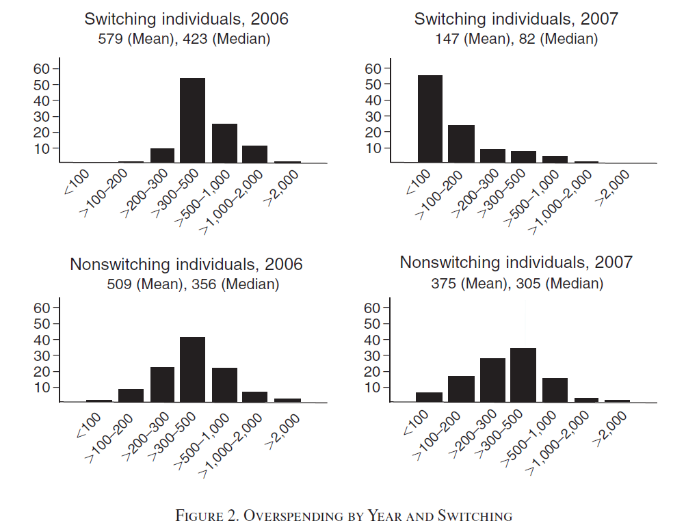

<!-- Adjust some CSS code for font size and maintain R code font size -->
<style type="text/css">
.remark-slide-content {
    font-size: 30px;
    padding: 1em 2em 1em 2em;    
}
.remark-code, .remark-inline-code { 
    font-size: 20px;
}
</style>


<!-- Set R options for how code chunks are displayed and load packages -->
```{r setup, include=FALSE}
options(htmltools.dir.version = FALSE)
library(knitr)
opts_chunk$set(
  fig.align="center",  
  fig.height=3, #fig.width=6,
  # out.width="748px", #out.length="520.75px",
  dpi=300, #fig.path='Figs/',
  cache=T#, echo=F, warning=F, message=F
  )

knitr::opts_hooks$set(fig.callout = function(options) {
  if(options$fig.callout) {
    options$echo = FALSE
  }
  options
})

```


# Table of contents

1. [Motivation](#motivation)

2. [Chernew et al. (2019)](#chernew)

3. [Ketcham et al. (2012)](#ketcham)

4. [Takeaways](#final)


<!-- New Section -->
---
class: inverse, center, middle
name: motivation

# Motivation

<html><div style='float:left'></div><hr color='#EB811B' size=1px width=1055px></html>

---
# Motivation

Huge movement toward "consumerism" in health care, see KFF study [here](https://www.healthsystemtracker.org/brief/tracking-the-rise-in-premium-contributions-and-cost-sharing-for-families-with-large-employer-coverage/)


---
# Motivation

- Do people shop for health care? (context of MRI scans)
- Do people learn what's best for them? (context of Medicare Part D)


<!-- New Section -->
---
class: inverse, center, middle
name: chernew

# Chernew et al. (2019)

<html><div style='float:left'></div><hr color='#EB811B' size=1px width=1055px></html>


---
# Main empirical question

Are health care services "shoppable"? Study this in the context of MRIs where quality is homogeneous.

<br>
--

- If so, more consumerism might be OK
- If not, need other tools for now


---
# Contribution

- Policy on "consumerism"
- Physician agency and role of physician referrals


---
# Preview of findings

- Patients pass 6 lower-priced facilities en route to selected facility
- 50% potential drop if people went to cheapest facility


---
count: false

# Preview of findings

.center[
  
]


---
# Main data:

- Private insurance claims in 2013 (single insurer, but a large one)
- SK&A data on physician practices
- Limit to orthopedics
- Data on who used a shopping tool provided by the insurer ($<$1%)

---
# Empirical analysis:

- Mainly descriptive statistics
- Calculate counterfactual prices using the mean price of each location


---
# Findings

- Markets have nearly 2x range from 20th to 80th price percentile
- $468.53 mean savings per case (55% drop) within 1 hour drive
- 36% drop without change in driving distance
- $<$ 1% shop
- Referring physician controls 50% of the savings


---
class: inverse, center, middle
name: ketcham

# Ketcham et al. (2012)

<html><div style='float:left'></div><hr color='#EB811B' size=1px width=1055px></html>

---
# Motivation

- Lots of perceived "poor" decisions in Part D choice
- What's the source of these poor decisions? 

<br>
--

- If people just *can't* make a good decision, then we need some intervention
- If people are learning, then perhaps less need for intervention

---
# Main empirical question

Do people improve the match quality of their Part D insurance choice over time?

---
# Contribution

- Large literature on poor decision making in insurance, especially Part D 
- Many interventions designed based off of this literature:<br>
  - decision assistance
  - default plan assignment
  - informational letters
  - restrictions on choice size

<br>  
--
**NOT** limited to insurance...credit cards, mortgages, other financial instruments

---
# Preview of findings

Yes, people overspend initially (i.e., choose a bad plan), but:

- 55% reduction in "overspending" from 2006 to 2007
- Largest reductions among those that overspent the most and among those with largest cognitive barriers
- Improved match driven mainly by those that switched plans

---
count: false

# Preview of findings

.center[
  
]


---
# Data

- Medicare Part D choices from 2006 to 2007
- Source: Private insurer that sells Part D and administers other Part D plans sold by other companies
- Variables: Plan choices, prescription drug use and spending


---
# Measuring overspending

- Employ CMS formulary files for copayment in each possible plan for each drug taken
- Drug prices in each plan from the Wolters Kluwer Health data or from CMS plan finder webiste
- Plan characteristics like deductibles and donut hole coverage
- **Main assumption**: Drug usage is independent of plan choice


---
# Econometric methods

First-difference regression of overspending on health status:

$$\Delta O_{i} = \alpha + \Gamma \times \Delta H_{i} + \Delta u_{i}.$$

---
# Results

.center[
  
]


---
# Heterogeneity

Series of alternative regressions with different control variables and indicators for switching

---
# Switching results

.center[
  
]


---
# Additional analysis

- Analysis of switching behaviors
- Robustness
- Generalizability (given data from one insurer)

---
class: inverse, center, middle
name: final

# Takeaways

<html><div style='float:left'></div><hr color='#EB811B' size=1px width=1055px></html>

---
# Chernew et al. (2019)

- Large price variation for homogeneous quality
- Potential for large savings
- "Shopping" may need to come from the physician

---
# Ketcham et al. (2012)

- People improve plan choices over time
- Interia and prevalence of "bad choices" may be overemphasized in literature and policy circles