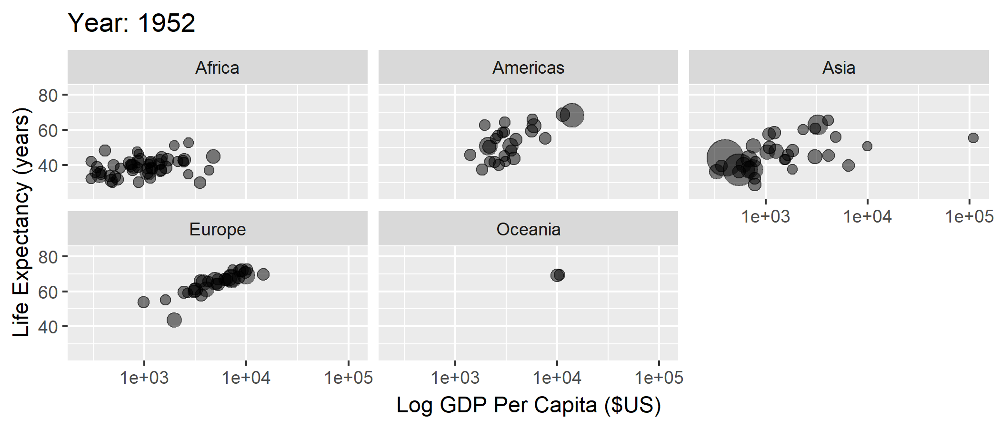

<!-- Adjust some CSS code for font size and maintain R code font size -->
<style type="text/css">
.remark-slide-content {
    font-size: 30px;
    padding: 1em 2em 1em 2em;    
}
.remark-code, .remark-inline-code { 
    font-size: 20px;
}
</style>


<!-- Set R options for how code chunks are displayed and load packages -->
```{r setup, include=FALSE}
options(htmltools.dir.version = FALSE)
library(knitr)
opts_chunk$set(
  fig.align="center",  
  fig.height=3, #fig.width=6,
  # out.width="748px", #out.length="520.75px",
  dpi=300, #fig.path='Figs/',
  cache=T#, echo=F, warning=F, message=F
  )

knitr::opts_hooks$set(fig.callout = function(options) {
  if(options$fig.callout) {
    options$echo = FALSE
  }
  options
})

if (!require("pacman")) install.packages("pacman")
pacman::p_load(tidyverse, ggplot2, dplyr, lubridate, readr, readxl, hrbrthemes,
               scales, gganimate, gapminder, gifski, png, tufte, plotly, OECD,
               ggrepel)
```


# Table of contents

1. [Introductions](#introductions)

2. [Motivation](#welcome)

3. [Software installation](#software)

4. [Starting with Git and RStudio](#git_rstudio)


<!-- New Section -->
---
class: inverse, center, middle
name: introductions

# Introductions

<html><div style='float:left'></div><hr color='#EB811B' size=1px width=1055px></html>


---
# Mad libs ice breaker

We need some ideas:

- name
- area of study
- book
- food
- fear
- liquid
- gift
- area of study

---
# Mad libs

*(name)* was excited to start school! Today, they were going to learn about *(area of study)*. They stayed up all night reading *(book)* and eating *(food)*. Now they are tired. They fall asleep in class, and dream about *(fear)*. They are awoken when the professor throws *(liquid)* at their desk. Feeling bad for sleeping, they give the professor a *(gift)*, apologize, and are careful to never sleep in class again. Now everyone is happy to learn more about *(area of study)*.


<!-- New Section -->
---
class: inverse, center, middle
name: welcome

# Motivation

<html><div style='float:left'></div><hr color='#EB811B' size=1px width=1055px></html>


---
# Health and Healthcare

</br>
.center[
  
]

---
# Health and Healthcare

We've made *major* improvements in life expectancy (and many other measures of health) across the world

- Poverty reduction
- Technology development and innovation
- Technology diffusion and adoption
- Access to better services, including healthcare


---
# Evidence of better health

```{r life-exp, eval=FALSE}
library(gapminder)
gapminder %>%
  group_by(year) %>%
  summarize(lifeExp = median(lifeExp),
            gdpMed = median(gdpPercap)) %>%
  ggplot(aes(year,lifeExp)) + geom_line(alpha = 1/3) + theme_bw() +
    labs(x = "Year",
         y = "Life Expectancy (years)",
         title = "Median life expectancy across the world")

```
.plot-callout[
```{r life-exp-callout, ref.label="life-exp", fig.callout=TRUE}
```
]


---
# Evidence of better health

```{r life-exp-full-output, ref.label="life-exp", fig.callout=TRUE}
```


---
# GDP and Health

```{r lifexp-gdp, eval=FALSE}
library(gapminder)
ggplot(data = gapminder, mapping = aes(x = gdpPercap, y = lifeExp)) + 
  geom_point(size = 1) + theme_bw() + scale_x_continuous(label = comma) +
  labs(x = "GDP Per Capita ($US)",
       y = "Life Expectancy (years)",
       title = "Life expectancy and GDP")
```
.plot-callout[
```{r lifexp-gdp-callout, ref.label="lifexp-gdp", fig.callout=TRUE}
```
]


---
# GDP and Health

```{r lifexp-full-output, ref.label="lifexp-gdp", fig.callout=TRUE}
```


---
# GDP and Health over Time

```{r gganim1, message=FALSE, warning=FALSE, include=FALSE}
anim1 <- ggplot(gapminder, aes(gdpPercap, lifeExp, size = pop)) +
  geom_point(alpha = 0.5, show.legend = FALSE) +
  scale_colour_manual(values = country_colors) +
  scale_size(range = c(2, 12)) +
  scale_x_log10() +
  facet_wrap(~continent) +
  labs(title = 'Year: {frame_time}', x = 'Log GDP Per Capita ($US)', y = 'Life Expectancy (years)') +
  transition_time(year) +
  ease_aes('linear')

anim_save("anim1.gif",anim1,
          path="D:/CloudStation/Professional/Teaching Material/Emory/Econ 771 - PhD Health Econ II/module-guides/pics")
```

.center[
  
]


---
# But the US is unique
```{r us-gap, message=FALSE, warning=FALSE, include=FALSE}
mycolors <- c("US" = "red", "other" = "grey50")
anim2 <- gapminder %>% filter(country %in% c("Canada", "France", "Germany", "Italy", "Japan", "United Kingdom", "United States")) %>%
  mutate(highlight = ifelse(country=="United States", "US", "other")) %>%
  ggplot(aes(gdpPercap, lifeExp, size = pop)) +
  geom_point(alpha = 0.5, show.legend = FALSE, aes(color=highlight)) +
  scale_color_manual("U.S.", values = mycolors) +
  scale_size(range = c(2, 12)) +
  scale_x_comma(limits=c(0,55000)) + 
  labs(title = 'Year: {frame_time}', x = 'GDP Per Capita ($US)', y = 'Life Expectancy (years)') +
  transition_time(year) +
  ease_aes('linear')

anim_save("anim2.gif",anim2,
          path="D:/CloudStation/Professional/Teaching Material/Emory/Econ 771 - PhD Health Econ II/module-guides/pics")
```

.center[
  
]


---
# Healthcare spending
```{r include=FALSE}
search_dataset("health",get_datasets())
oecd.str1 <- get_data_structure("SHA")
oecd.str2 <- get_data_structure("HEALTH_STAT")
oecd.exp <- get_dataset("SHA", filter=list("HFTOT", "HCTOT", "HPTOT", "PARPIB"))
oecd.health <- get_dataset("HEALTH_STAT", filter=list(c("MATIINFA","MATIMATM")))

health.dat <- oecd.health %>%
  filter(COU %in% c("USA", "GBR", "CAN", "FRA", "DEU", "ITA", "JPN")) %>%
  select(VAR, year = obsTime, value = obsValue, country = COU)
health.dat <- pivot_wider(health.dat, id_cols = c("year", "country"),
                          names_from = VAR, 
                          values_from = value) %>%
  rename(mort_inf = MATIINFA, mort_mat = MATIMATM)

exp.dat <- oecd.exp %>%
  filter(LOCATION %in% c("USA", "GBR", "CAN", "FRA", "DEU", "ITA", "JPN")) %>%
  select(year = obsTime, tot_exp = obsValue, country = LOCATION)

oecd.dat <- health.dat %>%
  left_join(exp.dat, by=c("year", "country")) %>%
  mutate(year=as.integer(year))

```

```{r spend, echo=FALSE, message=FALSE, warning=FALSE}
oecd.dat %>% filter(year>=1970) %>%
  ggplot(aes(x=year,y=tot_exp,color=country)) + 
  geom_line(show.legend = FALSE) + theme_bw() +
  geom_text_repel(data = oecd.dat %>% filter(year == 2014), 
            aes(label = country,
                x = year + 1,
                y = tot_exp),
            show.legend = FALSE) +
  guides(linecolor=FALSE) +
  labs(
    x="Year",
    y="Spending as Share of GDP",
    title="Healthcare Spending over Time"
  ) + xlim(1970, 2017)
```


---
# Spending and infant mortality
```{r spend-inf-mort, message=FALSE, warning=FALSE, include=FALSE}
anim4 <- oecd.dat %>% filter(year>=1970) %>% group_by(country) %>% fill(c(tot_exp, mort_inf), .direction="updown") %>%
  ggplot(aes(tot_exp, mort_inf, label=country)) +
  geom_text(aes(size=3), show.legend=FALSE) + theme_bw() + 
  labs(title = 'Year: {frame_time}', x = 'Healthcare Spending (%GDP)', y = 'Infant Mortality') +
  transition_time(year) +
  ease_aes('linear')
anim_save("anim4.gif",anim4,
          path="D:/CloudStation/Professional/Teaching Material/Emory/Econ 771 - PhD Health Econ II/module-guides/pics")
```

.center[
  
]


---
# Spending and maternal mortality
```{r spend-mat-mort, message=FALSE, warning=FALSE, include=FALSE}
anim5 <- oecd.dat %>% filter(year>=1970 & year<=2012) %>% group_by(country) %>% fill(c(tot_exp, mort_mat), .direction="updown") %>%
  ggplot(aes(tot_exp, mort_mat, label=country)) +
  geom_text(aes(size=3), show.legend=FALSE) + theme_bw() + 
  labs(title = 'Year: {frame_time}', x = 'Healthcare Spending (%GDP)', y = 'Maternal Mortality') +
  transition_time(year) +
  ease_aes('linear')
anim_save("anim5.gif",anim5,
          path="D:/CloudStation/Professional/Teaching Material/Emory/Econ 771 - PhD Health Econ II/module-guides/pics")
```

.center[
  
]


---
# Why study healthcare

1. Health and healthcare are constantly changing

2. <span>&#36;</span>3.5 trillion, 17.9% of GDP, <span>&#36;</span>10,739 per person

3. Coronavirus shows interconnected web of economics, health policy, public policy, public health

4. U.S. healthcare is uniquely inefficient in many ways


---
# Economic issues in healthcare

Lots of interesting economic issues in healthcare (not all unique to the U.S.):

1. Extremely heterogeneous products

2. Asymmetric information between patients and physicians

3. Unobservable quality (experience good)

4. Unpredictable need (inability to shop in many cases)

5. Distortion of incentives due to insurance

6. Adverse selection (asymmetric information between patients and insurers)


---
# What about this class specifically?

1. Overlap with industrial organization and healthcare

2. Data challenges and opportunities

3. Good blend of microeconomic theory and applied empirical micro


<!-- New Section -->
---
class: inverse, center, middle
name: syllabus

# Syllabus highlights

<html><div style='float:left'></div><hr color='#EB811B' size=1px width=1055px></html>

(Read the full document [here](https://imccart.github.io/Econ-771/syllabus.pdf))


---
# Structure

- *Substantive* areas

  - Hospital ownership and production
  
  - Physician agency
  
  - Information disclosure and choice
  
  - Competition and industrial organization


---
# Structure

- *Applying* canonical methods for causal inference
  
  - Instrumental variables
  
  - Regression discontinuity
  
  - Difference-in-differences


---
# Structure

- *Datasets* from the real world

  - Hospital Cost Report Information System (HCRIS)
  
  - Inpatient Prospective Payment System (IPPS) Final Rule Files
  
  - Provider of Services (POS) files
  
  - Provider Utilization and Payment Public Use Files (PUF)
  
  - Medicare Advantage Insurance Data
  
---
# Structure

- Practical *workflow* for replicable work

  - Git and GitHub
  
  - Practice with cloud computing
  
  - Extracting and managing raw data
  
  
---
# Assignments

- Empirical exercises (x4)

- Presentation (x2)

- Lit review or draft paper

- Replication

- Discussion

---
# Grading

| Component                           | Weight |
|:-|-:|
| Online discussions                  | 5%  |
| 4 × empirical exercies (5% each)    | 20% |
| 2 x presentations (10% each)        | 20% |
| Lit review/draft paper              | 25% |
| Replication                     		| 30% |


<!-- New Section -->
---
class: inverse, center, middle
name: software

# Software Installation
<html><div style='float:left'></div><hr color='#EB811B' size=1px width=1055px></html>


---
# Software Installation

1. Download [R](https://www.r-project.org/)

2. Download [RStudio](https://www.rstudio.com/products/rstudio/download/preview/)

3. Download [Git](https://git-scm.com/downloads)

4. Create an account on [GitHub](https://github.com/)

--

For help and troubleshooting with Git and GitHub, take a look at Jenny Bryan's http://happygitwithr.com.


---
# Checklist

<html>&#9745;</html> Do you have the most recent version of R?
  ```{r}
  version$version.string
  ```


<html>&#9745;</html> Do you have the most recent version of RStudio? (The [preview version](https://www.rstudio.com/products/rstudio/download/preview/) is fine.)
  ```{r eval=FALSE}
  RStudio.Version()$version
  ## Requires an interactive session but should return something like "[1] ‘1.1.463’"
  ```

<html>&#9745;</html> Have you updated all of your R packages? 
  ```{r eval=FALSE}
  update.packages(ask = FALSE, checkBuilt = TRUE)
  ```
  
---
# Checklist

- Open up the [shell](http://happygitwithr.com/shell.html#shell)

- Windows users, make sure that you installed a Bash-compatible version of the shell. If you installed [Git for Windows](https://gitforwindows.org), then you should be good to go.


---
# Checklist

<html>&#9745;</html> Which version of Git have you installed?
  ```{r eval=FALSE}
  git --version
  ```

<html>&#9745;</html> Did you introduce yourself to Git? (Substitute in your details.)
  ```{r eval=FALSE}
  git config --global user.name 'Ian McCarthy'
  git config --global user.email 'ian.mccarthy@emory.edu'
  git config --global --list
  ```

<html>&#9745;</html> Did you register an account in GitHub?


<!-- New Section -->
---
class: inverse, center, middle
name: git_rstudio

# Practice with Git and RStudio
<html><div style='float:left'></div><hr color='#EB811B' size=1px width=1055px></html>


---
# Before next class (see http://happygitwithr.com)

1. Download [R](https://www.r-project.org/)

2. Download [RStudio](https://www.rstudio.com/products/rstudio/download/preview/)

3. Download [Git](https://git-scm.com/downloads)

4. Create an account on [GitHub](https://github.com/)

5. Connect RStudio to Git and GitHub

6. Start/clone/fork a repository for this class 


---
# Setting things up

Now we're going to clone a GitHub repository (repo) using RStudio.

.center[
  
]


---
# Some common mistakes for windows users

- Windows folders are *not* files...there is no content without a file. You can't commit or push changes without content.

- Let RStudio/GitHub create the directory (main folder) for you.

- If you're working across devices on your own repo, be sure to pull before starting and push afterward.

- Avoid spaces in file names. Avoid them at all costs. *DO NOT PUT SPACES IN YOUR FILE NAMES.*

>*"A space in a file name is a space in your soul."*


---
# Ideal workflow

Until you are a Git(Hub) expert...

1. Start project on GitHub (fork from another repo if needed)

2. Clone to desktop with RStudio

3. See http://happygitwithr.com for instructions on linking your local repo with a new upstream remote

