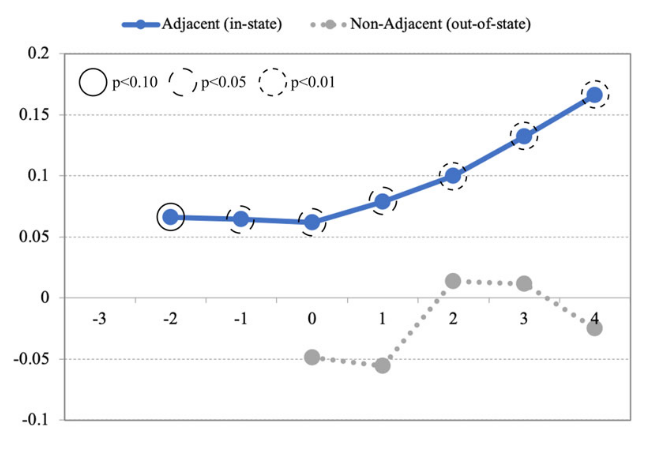
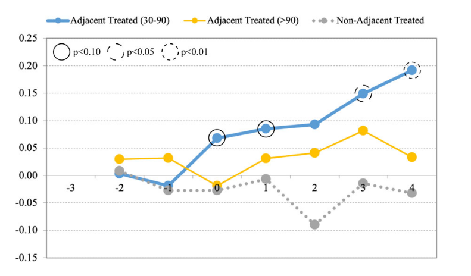

<!-- Adjust some CSS code for font size and maintain R code font size -->
<style type="text/css">
.remark-slide-content {
    font-size: 30px;
    padding: 1em 2em 1em 2em;    
}
.remark-code, .remark-inline-code { 
    font-size: 20px;
}
</style>


<!-- Set R options for how code chunks are displayed and load packages -->
```{r setup, include=FALSE}
options(htmltools.dir.version = FALSE)
library(knitr)
opts_chunk$set(
  fig.align="center",  
  fig.height=3, #fig.width=6,
  # out.width="748px", #out.length="520.75px",
  dpi=300, #fig.path='Figs/',
  cache=T#, echo=F, warning=F, message=F
  )

knitr::opts_hooks$set(fig.callout = function(options) {
  if(options$fig.callout) {
    options$echo = FALSE
  }
  options
})

```


# Table of contents

1. [Motivation](#motivation)
2. [Theory](#theory)
3. [Research Design](#design)
4. [Results](#results)


<!-- New Section -->
---
class: inverse, center, middle
name: motivation

# Motivation

<html><div style='float:left'></div><hr color='#EB811B' size=1px width=1055px></html>


---
# Economic intuition

- Insurers bundle features of a product (health care services) and sell them as one "plan"
- Hospitals are a major part of this bundle
- Hospital mergers may then affect customers even when one of the merging entities is not in the same geographic market
- Employers act as "common customers" in this setup

<br>
--
Contribution to understanding of merger effects and, practically, to merger analysis

<!-- New Section -->
---
class: inverse, center, middle
name: theory

# Theory

<html><div style='float:left'></div><hr color='#EB811B' size=1px width=1055px></html>

---
# Model setup

- Standard bargaining model, simplified for two hospitals
- Show that merger price effects will be positive if: $$\Phi(G) - \Phi(G_{-s}) > \sum_{h_{1},h_{2}} \left(\Phi(G) - \Phi(G_{-h}) \right)$$

<br>
--
Intuition: The value of the hospital system $s$ (two hospitals) exceeds the sum of the value of each hospital individually (formally, the insurer's objective is submodular in its network of hospitals)

---
# Model predictions
$$\Phi(G) - \Phi(G_{-s}) > \sum_{h_{1},h_{2}} \left(\Phi(G) - \Phi(G_{-h}) \right)$$

A few cases of interest:
1. Prices increase if hospitals are substitutes (value of $h_{1}$ is lower if $h_{2}$ is already in the network, and vice versa)
2. Prices decrease if hospitals are complements
3. No change if markets are separable (often assumed for simplicity, but likely unrealistic)

---
# Empirical prediction

Thinking of employers as common customers, then cross-market mergers should increase prices under many reasonable assumptions


<!-- New Section -->
---
class: inverse, center, middle
name: design

# Research Design and Data

<html><div style='float:left'></div><hr color='#EB811B' size=1px width=1055px></html>

---
# Empirical setting

- Look at acquisitions among existing hospital systems
- Focus on hospitals that are already members of the system
- Exclude the systems operating in the same local market
- "Adjacent" treatment: hospitals in merging systems that co-exist in the same state (but not local) market
- "Nonadjacent" treatment: hospitals in one of the merging systems but the other system doesn't co-exist in the same state market

---
# Data

- Pricing data from HCRIS
- Merger data from FTC (narrow sample) and Irving Levin Hospital Acquisition Reports (broad sample)
- Limitations: Not many mergers to work with, especially given the market and system-membership restrictions

---
# Estimation

Essentially an event study approach: $$\ln(price_{ht}) = \alpha_{h} + \sum_{t} \phi_{t}^{a} 1^{a}_{h,t} + \sum_{t}\phi_{t}^{na}1^{na}_{h,t} + X_{ht} \theta + \tau_{t} + \epsilon_{ht}$$


<!-- New Section -->
---
class: inverse, center, middle
name: results

# Results

<html><div style='float:left'></div><hr color='#EB811B' size=1px width=1055px></html>


---
# FTC Mergers Only

.center[
  
]

---
# Full sample

.center[
  
]

---
# Takeaways

- 7 to 10% increase in price for "adjacent" treated hospitals in the same state
- No significant effect for same-system hospitals out-of-state

---
# Threats and limitations

- Noisy estimates with lack of pre-treatment data
- Hard to say that the mergers are unrelated to other markets, since systems compete in the other markets too

