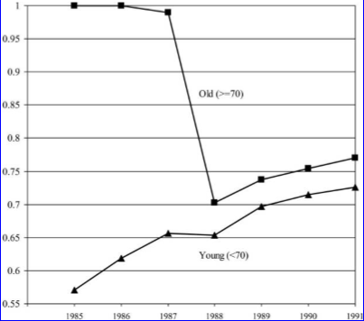
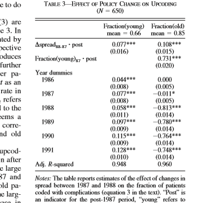
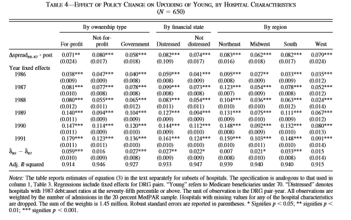

<!-- Adjust some CSS code for font size and maintain R code font size -->
<style type="text/css">
.remark-slide-content {
    font-size: 30px;
    padding: 1em 2em 1em 2em;    
}
.remark-code, .remark-inline-code { 
    font-size: 20px;
}
</style>


<!-- Set R options for how code chunks are displayed and load packages -->
```{r setup, include=FALSE}
options(htmltools.dir.version = FALSE)
library(knitr)
opts_chunk$set(
  fig.align="center",  
  fig.height=3, #fig.width=6,
  # out.width="748px", #out.length="520.75px",
  dpi=300, #fig.path='Figs/',
  cache=T#, echo=F, warning=F, message=F
  )

knitr::opts_hooks$set(fig.callout = function(options) {
  if(options$fig.callout) {
    options$echo = FALSE
  }
  options
})

```


# Table of contents

1. [Motivation](#motivation)

2. [Research Design](#design)

3. [Intensive Margin](#intensive)

4. [Extensive Margin](#extensive)

5. [Hospital-level Changes](#overall)

6. [Takeaways](#conc)


<!-- New Section -->
---
class: inverse, center, middle
name: motivation

# Motivation

<html><div style='float:left'></div><hr color='#EB811B' size=1px width=1055px></html>


---
# Two motivating points

1. Hospital responses to changes in policy or strategic responses to each other depend on their objective functions

2. If not-for-profit hospitals are really "for profits in disguise", then we need to treat them as such


<!-- New Section -->
---
class: inverse, center, middle
name: design

# Research Design

<html><div style='float:left'></div><hr color='#EB811B' size=1px width=1055px></html>

---
# Research design

Exploit exogenous change in DRG payments in 1988...

--

.center[
and now for a **PPS Primer**<br>
  
]

---
# DRG and the PPS

- Diagnosis Related Groups (DRGs)...[2020 DRG codes](https://www.cms.gov/Medicare/Medicare-Fee-for-Service-Payment/AcuteInpatientPPS/FY2020-IPPS-Final-Rule-Home-Page-Items/FY2020-IPPS-Final-Rule-Tables)
- Prospective Payment System (PPS) introduced in 1983 as replacement to cost-plus reimbursement<br>

--
$$p_{hd} = \bar{p} \times w_{d} \times \gamma_{h}$$

---
count: false

# DRG and the PPS

- Diagnosis Related Groups (DRGs)
- Prospective Payment System (PPS) introduced in 1983 as replacement to cost-plus reimbursement

$$p_{hd} = \color{red}{\bar{p}} \times w_{d} \times \gamma_{h}$$

  - federal base payment


---
count: false

# DRG and the PPS

- Diagnosis Related Groups (DRGs)
- Prospective Payment System (PPS) introduced in 1983 as replacement to cost-plus reimbursement

$$p_{hd} = \bar{p} \times \color{red}{w_{d}} \times \gamma_{h}$$

  - federal base payment
  - drg weight (adjustment $\in [0.09, 22.8]$)


---
count: false

# DRG and the PPS

- Diagnosis Related Groups (DRGs)
- Prospective Payment System (PPS) introduced in 1983 as replacement to cost-plus reimbursement

$$p_{hd} = \bar{p} \times w_{d} \times \color{red}{\gamma_{h}}$$

  - federal base payment
  - drg weight (adjustment $\in [0.09, 22.8]$)
  - hospital-specific adjustments (wage index, DSH, IME)


---
count: false

# DRG and the PPS

- Diagnosis Related Groups (DRGs)
- Prospective Payment System (PPS) introduced in 1983 as replacement to cost-plus reimbursement
- Change to DRGs in 1988:
  - "with complications or age over 69" became "with complications"
  - "without complications and age under 70" became "without complications"

<!-- New Section -->
---
class: inverse, center, middle
name: intensive

# Intensive Margin

<html><div style='float:left'></div><hr color='#EB811B' size=1px width=1055px></html>


---
# Intesive margin

- Dafny calls this the "nominal" effect
- Recoding to put patient into most profitable DRG category
- aka "upcoding"

---
# Identifying upcoding

- Chart review
- Share of patients in "top" code (highest paying code)

--

.center[
  
]


---
# Estimation

$$\begin{align}
\text{share}_{pt} = \alpha + \beta_{1} \text{pair}_{p} + \beta_{2} Y_{t} + \beta_{3} \Delta\text{spread}_{pt}\times \mathbf{1}(t>1988) + \varepsilon_{pt}
\end{align}$$

---
count: false

# Estimation

$$\begin{align}
\color{red}{\text{share}}_{pt} = \alpha + \beta_{1} \text{pair}_{p} + \beta_{2} Y_{t} + \beta_{3} \Delta\text{spread}_{pt}\times \mathbf{1}(t>1988) + \varepsilon_{pt}
\end{align}$$


- Share of patients in top DRG code within pair $p$ in year $t$
- Claims data from 20% MedPAR files

---
count: false

# Estimation

$$\begin{align}
\text{share}_{pt} = \alpha + \beta_{1} \color{red}{\text{pair}}_{p} + \beta_{2} \color{red}{Y}_{t} + \beta_{3} \Delta\text{spread}_{pt}\times \mathbf{1}(t>1988) + \varepsilon_{pt}
\end{align}$$


- Indicators for DRG pairs and year

---
count: false

# Estimation

$$\begin{align}
\text{share}_{pt} = \alpha + \beta_{1} \text{pair}_{p} + \beta_{2} Y_{t} + \beta_{3} \color{red}{\Delta\text{spread}}_{pt}\times \mathbf{1}(t>1988) + \varepsilon_{pt}
\end{align}$$

- Change in spread (DRG weight in top code less the DRG weight in the bottom code) from 1987 to 1988.
- DRG weights from the *Federal Register*, published annually

---
# Results


.center[
  
]


---
# Variation by hospital

.center[
  
]

- Difference in year dummies in bottom row
- Inteprets as distinction between FP and NFP...is that fair?

<!-- New Section -->
---
class: inverse, center, middle
name: extensive

# Extensive Margin

<html><div style='float:left'></div><hr color='#EB811B' size=1px width=1055px></html>


---
# Extensive margin

- Dafny calls this the "real" effect
- Measures whether hospitals actually changed how they treat patients (costs, total volume)
- Switches to price as main independent variable and IV strategy

--
- **Results:** Not much of a response

<!-- New Section -->
---
class: inverse, center, middle
name: overall

# Hospital-level Changes

<html><div style='float:left'></div><hr color='#EB811B' size=1px width=1055px></html>


---
# Hospital-level changes

If hospitals upcoded with no change in aggregate outcomes, what did they do with the money?

---
# Estimation

$$\begin{align}
\text{ln(intensity)}_{ht} = \alpha + \beta_{1} \text{hospital}_{h} + \beta_{2} Y_{t} + \beta_{3} \text{ln}(price)_{ht} + \varepsilon_{pt}
\end{align}$$


---
count: false

# Estimation

$$\begin{align}
\text{ln(intensity)}_{ht} = \alpha + \beta_{1} \text{hospital}_{h} + \beta_{2} Y_{t} + \beta_{3} \text{ln(price)}_{ht} + \varepsilon_{pt}
\end{align}$$

- $\ln(price)$ is endogenous...use **Bartik** or **shift-share** instrument

--

$$\ln(price)_{ht} = \delta + \gamma_{1} \text{hospital}_{h} + \gamma_{2} Y_{t} + \gamma_{3} \text{shareCC}_{h} \times \mathbf{1}(y>1988) + \mu_{ht}$$
- $\text{shareCC}_{h}$ denotes share of young patients coded with CC in 1987


---
count: false

# Estimation

$$\begin{align}
\text{ln(intensity)}_{ht} = \alpha + \beta_{1} \text{hospital}_{h} + \beta_{2} Y_{t} + \beta_{3} \text{ln(price)}_{ht} + \varepsilon_{pt}
\end{align}$$

- $\ln(price)$ is endogenous...use **Bartik** or **shift-share** instrument
- For more on Bartik instruments, see [Goldsmith-Pinkham, Sorkin, and Swift (2020)](https://www.aeaweb.org/articles?id=10.1257/aer.20181047). 

<!-- New Section -->
---
class: inverse, center, middle
name: conc

# Takeaways

<html><div style='float:left'></div><hr color='#EB811B' size=1px width=1055px></html>


---
# Takeaways

- Compelling research design
- Strong findings regarding upcoding
- Not clear on FP versus NFP response given the other estimates
- Not clear on IV and how to interpret in heterogeneous settings